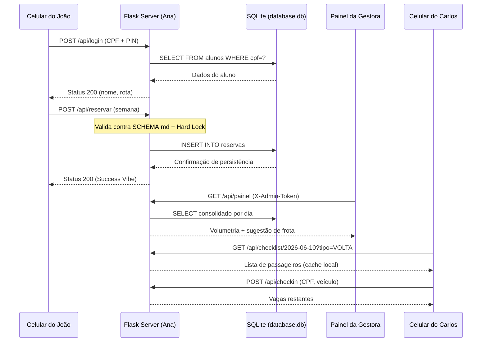

# 🗺️ 06-WIREFRAME_IDEAS.md: Arquitetura Visual e Esboços

## 📑 1. Objetivo da Arquitetura

Este documento serve como o "esqueleto" e guia visual para a implementação. Ele garante a aplicação da **Regra 80/20** (foco no que entrega valor) e do princípio **Data-First**, onde a interface respeita rigorosamente o contrato do `SCHEMA.md`.

---

## 👥 2. Diagrama de Caso de Uso (DCU)

*Visão funcional de alto nível descrevendo quem faz o quê no sistema.*

```mermaid
useCaseDiagram
    actor "João (Aluno)" as J
    actor "Ana (Gestora)" as A
    actor "Carlos (Motorista)" as C
    
    package "Sistema de Transporte Universitário VEM" {
        usecase "Fazer Login (CPF + PIN)" as UC1
        usecase "Reservar Semana (Ida/Volta)" as UC2
        usecase "Visualizar Painel de Frota" as UC3
        usecase "Gerenciar Vagas de Exceção" as UC4
        usecase "Exportar Lista CSV" as UC5
        usecase "Validar Embarque (Checklist)" as UC6
    }
    
    J --> UC1
    J --> UC2
    A --> UC3
    A --> UC4
    A --> UC5
    C --> UC6
```

---

## 📱 3. Wireframe: Tela do João (Mobile-First)

*Foco: Reserva semanal ultra-rápida (< 10s) com design Glassmorphism.*

**Tela 1 — Login:**

1. **Header:** Logo translúcido + "Transporte Universitário".
2. **Card Central (Glassmorphism):**
    * Fundo com `blur(12px)` e borda fina branca.
    * `cpf`: Input numérico com máscara (11 dígitos).
    * `pin`: Input numérico de 4 dígitos (senha).
3. **Botão CTA:** "Entrar" (Cor sólida para alto contraste AAA, touch target ≥ 48px).

**Tela 2 — Calendário Semanal:**

1. **Header:** Saudação com nome do aluno + rota.
2. **5 Cards (Seg–Sex):** Cada card contém:
    * Nome do dia e data.
    * Toggle "IDA" (ícone ônibus →).
    * Toggle "VOLTA" (ícone ônibus ←).
3. **Botão CTA:** "Confirmar Semana" (cor sólida, alto contraste AAA).

**Tela 3 — Sucesso:**

1. Animação de check SVG embutido.
2. Resumo: "Você reservou ida e volta para Seg, Ter e Qui."
3. Botão: "Alterar Reservas".

---

## 🖥️ 4. Wireframe: Painel da Ana (Desktop Admin)

*Foco: Dimensionamento de frota e gestão de exceções.*

**Estrutura Visual:**

1. **Login Admin:** Modal com senha → `sessionStorage` → Header `X-Admin-Token`.
2. **Dashboard:** Cards com volumetria por dia (Total Ida: X | Total Volta: Y).
3. **Sugestão de Frota:** Algoritmo exibe combinação ideal de veículos por trecho.
4. **Tabela de Alunos:**
    * Colunas: Nome | CPF | Rota | Tipo Vaga | Ida | Volta.
    * Filtro por: dia, rota, tipo de vaga.
5. **Gestão de Exceções:** Botão para marcar/desmarcar alunos como "Vaga Reservada".
6. **Barra de Ação:** Botão "Exportar CSV" que gera o arquivo com BOM e cabeçalhos corretos.

---

## 🔄 5. Diagrama de Sequência (Fluxo de Dados)

*Detalhamento da interação entre o celular do João, o painel da Ana e o checklist do Carlos.*



---

## 🎨 6. Mock Data e Estética (The Vibe)

Para validar a interface antes da conexão real com o backend, o Agente José deve usar:

* **Paleta de Cores:** Gradientes lineares profundos (Deep Blue para Dark Purple).
* **Comportamento Login:** Ao clicar em "Entrar", transição suave para o calendário semanal.
* **Comportamento Reserva:** Ao confirmar a semana, o calendário deve sumir com transição suave, exibindo uma tela de sucesso com um ícone de "Check" animado (SVG embutido) e o resumo das reservas.
* **Resiliência:** A interface deve carregar apenas ativos locais para garantir o funcionamento **Offline-First**.

---

### 🛂 Instrução para a IA
>
> *"José, use este wireframe como base inegociável para o `index.html`. Não adicione 'enfeites' que aumentem a latência ou o consumo de dados. Ana, certifique-se de que o motor backend suporte exatamente o fluxo descrito no Diagrama de Sequência. Carlos (Motorista) deve ter sua interface descrita no `motorista.html`."*
